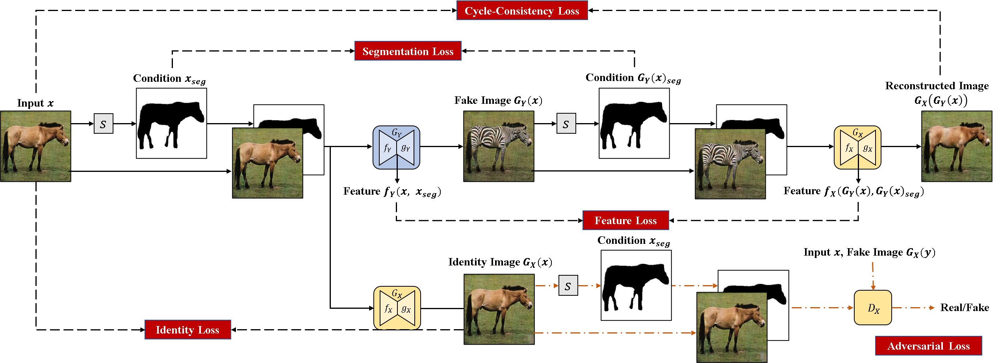

# DiGAN-pytorch
 Directional Generative Adversarial Network for Object Transfiguration
## DiGAN Architecture

## Comparsion with State-of-the-Art Methods
### Horse to Zebra Translation


## Prerequisites
- Linux
- Python 3
- CPU or NVIDIA GPU + CUDA CuDNN

## Getting Started
### Installation

- Clone this repo:
```bash
git clone https://github.com/Annalina-Luo/DiGAN-pytorch
cd DiGAN-pytorch
```

- Install [PyTorch](http://pytorch.org) 1.8.0 and other dependencies (e.g., torchvision, [visdom](https://github.com/facebookresearch/visdom) and [dominate](https://github.com/Knio/dominate)).
  - For pip users, please type the command `pip install -r requirements.txt`.
  - For Conda users, you can create a new Conda environment using `conda env create -f environment.yml`.

- Install [Detectron2] 0.6
See [installation instructions](https://detectron2.readthedocs.io/tutorials/install.html).
